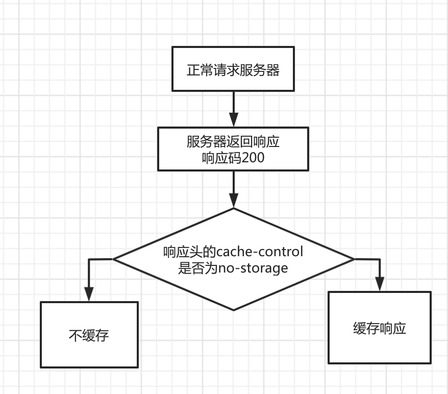
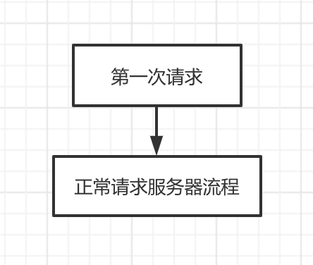
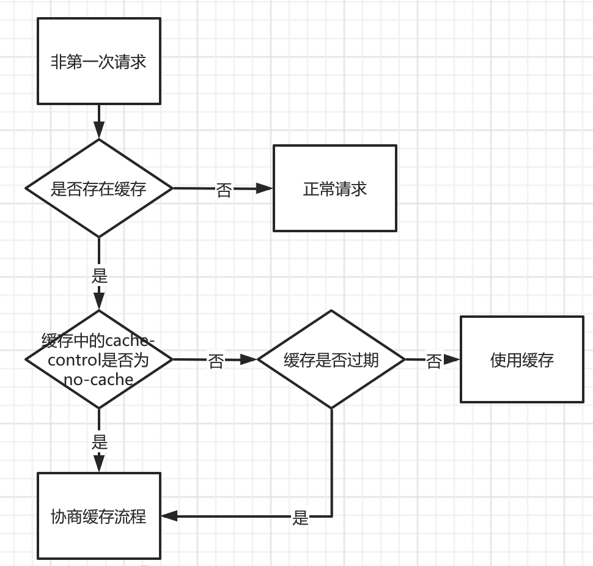
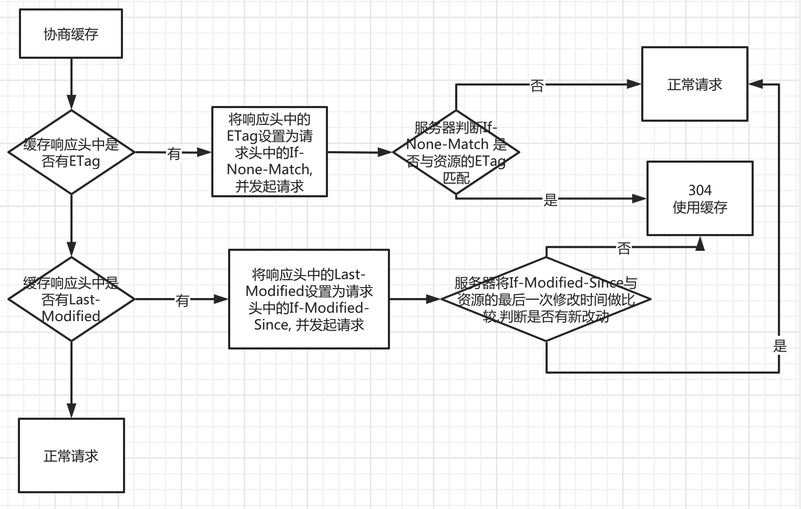

<!-- toc -->
<!--more-->

## 简介

HTTP有一套缓存机制来加快响应时间,提高网页响应速度.

一般会将一些静态资源缓存下来, 下次再次请求这个资源的时候, 在条件允许的情况直接使用缓存.

​    

## 响应头

有一些响应头的字段跟我们的缓存息息相关

​    

### 响应头字段名
#### Cache-Control (HTTP/1.1)
描述:
设置缓存策略

值:
Cache-Control 可设置的策略:

no-storage: 不允许缓存数据到本地

public: 允许用户/代理服务器缓存数据到本地

private: 只允许用户缓存数据到本地

max-age: 缓存的有效时间

no-cache: 协商缓存, 每次需要发请求询问缓存是否可用

​    
#### Last-Modified
描述:
资源的最后一次修改时间
​    
#### ETag
描述:
资源的唯一标识(根据文件内容计算出的摘要值)
​    
#### Expires(HTTP1.0的产物): 
描述:
缓存的响应的过期时间 (GMT时间格式)
优先级小于cache-control, 指定了cache-control的情况下, Expires不生效
​    
### ETag相比Last-Modified的优点:

1. 如果内容修改后, 又回滚了, 这时候, 内容没有发生变化,但是Last-Modified却变化了, 本可以直接使用缓存,但还是像服务器请求了资源
2. Last-Modified只能精确到秒级别, 如果在获取到资源后的一秒内发生了更新, 那么在以后的请求中, 无法获得最新资源 

​    
## 请求头

有一些请求头的字段也跟我们的缓存息息相关
​    
### 请求头字段名
#### If-Modified-Since
描述:
与上一次请求的响应中的响应头字段Last-Modified对应
​    
#### If-None-Match
描述:
与上一次请求的响应中的响应头字段ETag对应
​    
#### cache-control
描述:
用来指定本次请求的缓存机制
​    
##  缓存流程

###条件Get方法

满足以下两个条件的请求即是条件Get方法

1. 请求使用Get方法
2. 请求报文中包含 `If-Modified-since` 或者 `ETag`
​   

针对条件get方法, 服务器根据`If-Modified-since` 或者 `ETag`,  可能会响应两种状态码

1. 200, 这种说明缓存不可用, 返回新的完整响应
2. 304, 这种代表缓存可用, 返回响应头, 不返回响应体
​    
### 无缓存正常请求服务器流程

​    

### 第一请求资源流程

    
### 非第一次请求资源流程

    

### 协商缓存流程

